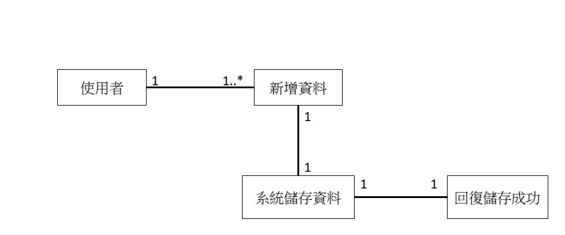
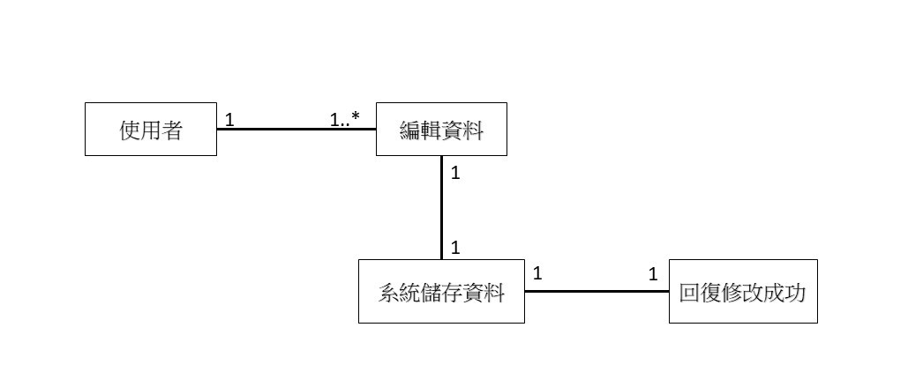
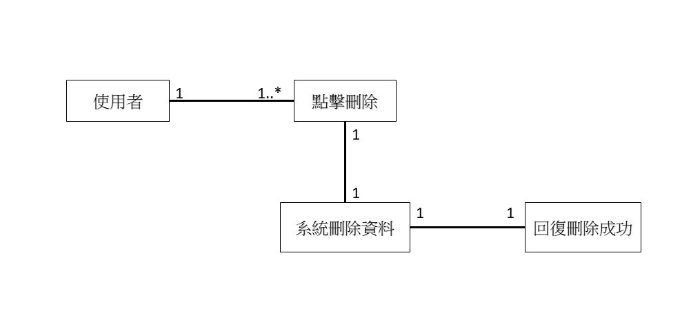
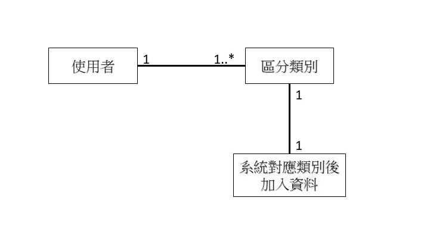
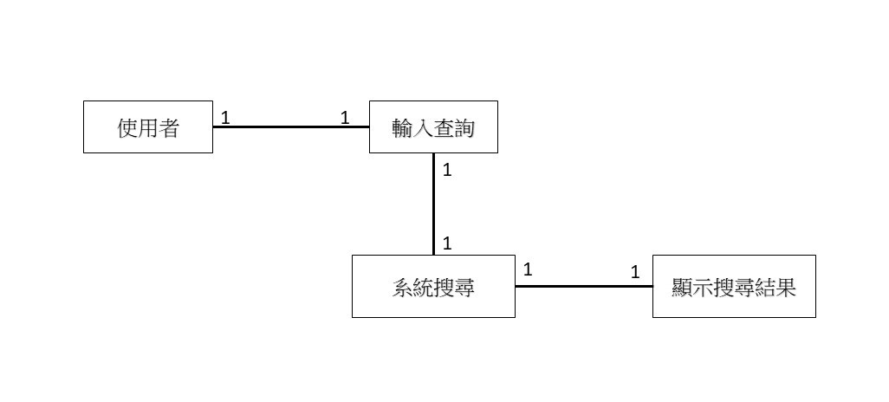
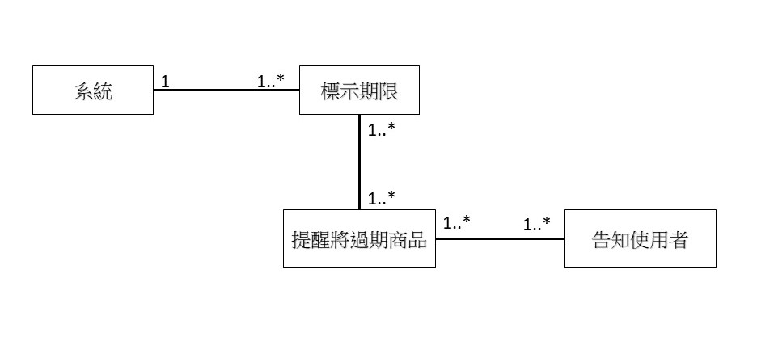
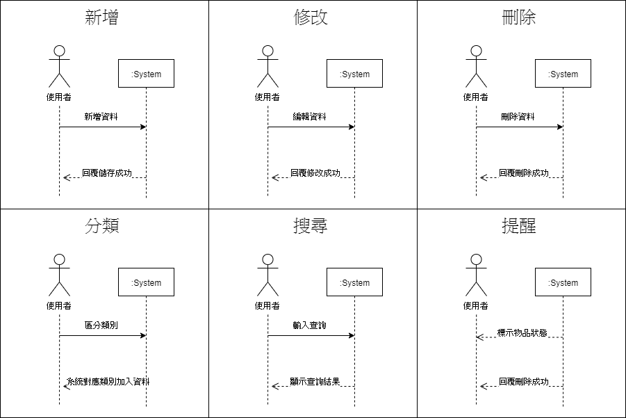
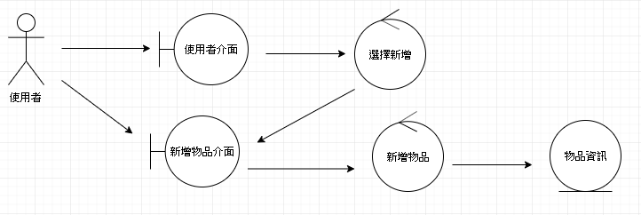

# 智慧物品管家
### 專題需求：管理物品有效日期、放置位置
### 功能性需求：
```
1、建立資料
2、分類查詢
3、物品搜尋
4、提醒即將過期
```
### 非功能性需求：
```
1、操作性：可跨平台使用
2、效能：系統每24小時應該更新貨品資訊
3、安全：只有個人可以編輯及觀看
4、文化與政策性：系統必須遵循各國包裝食品日期標示方式
```
### 使用案例圖：


### 使用案例的重要性：
```
1、建立資料
2、物品搜尋
3、提醒即將過期
```
### 使用案例：

一、建立資料
```
1、新增
　 1-1使用者新增資料
   1-2系統儲存資料
   1-3回覆「新增成功」
2、修改
   2-1使用者編輯資料
   2-2系統更新資料
   2-3回覆「修改成功」
3、刪除
   3-1使用者點擊刪除
   3-2系統刪除資料
   3-3回覆「刪除成功」
4、分類
   4-1使用者將物品區分類別
   4-2系統對應類別加入資料
```
二、物品搜尋
```
1、使用者輸入欲查詢之物品
2、系統搜尋對應之物品
3、系統顯示查詢結果
```
三、提醒即將過期
```
1、系統自動辨別物品期限狀態並標示狀態
2、系統提醒即將過期之物品
3、顯示訊息告知使用者
```

### user story：
```
身為一個物品管理者，我希望能透過App管理物品，藉由分類的方式，快速找到該類物品的詳細狀態。若想要知道特定商品的有效期限時，可以透過搜尋功能找到自己想查詢的商品，且可以提醒我有效期限即將到了，使我可以更有效率地控管。
```

### 初步類別圖:
> 新增

> 修改

> 刪除

> 分類

> 查詢

> 提醒


### 系統循序圖:


### 強韌圖:
> 新增

