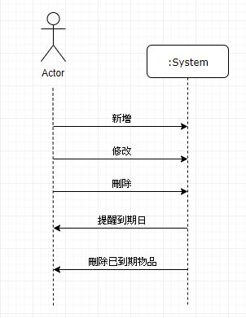

# `智慧物品管家`
### 專題需求：管理物品有效日期、放置位置
### 功能性需求：
```
> 新增（物品名稱、有效日期、放置地區）

>修改

>刪除　

>分類

>搜尋（查詢物品詳細資訊）

>提醒（一個禮拜後將過期）

```
### 非功能性需求：
```
> 操作性：可跨平台使用

> 效能：系統每24小時應該更新貨品資訊

> 安全：只有個人可以編輯及觀看

> 文化與政策性：系統必須遵循各國包裝食品日期標示方式
```
### 使用案例圖：

### 6個使用案例：
```
> 新增
使用者新增資料
系統儲存資料
回覆「新增成功」
> 刪除
使用者點擊刪除
系統刪除資料
回覆「刪除成功」
> 修改
使用者編輯資料
系統更新資料
回覆「修改成功」
> 分類
使用者將物品區分類別
系統對應類別加入資料
> 搜尋
使用者輸入欲查詢之物品
系統搜尋對應之物品
系統顯示查詢結果
> 提醒
系統自動辨別物品期限狀態並標示狀態
系統提醒即將過期之物品
顯示訊息告知使用者
```
### user story：

```
> 身為一個物品管理者，我可以在App上新增我的物品，並且管理物品的分類，
藉由分類的方式，快速找到該類物品的詳細狀態。若想要知道特定商品的有效期限時，
可以透過搜尋功能找到自己想查詢的商品，且可以提醒我有效期限即將到了，使我可以更有效率地控管。

> 身為一個家庭主婦，我希望有一個方便管理周遭物品的程式，這樣才不會因為沒注意到物品過期而誤吃或誤用。
我透過紀錄物品詳細資訊，讓系統在物品快到期時，自動提醒我快點將物品使用完畢，如果我超過時間還是忘了用，
它會顯示過期，讓我在搜尋到它的時候會知道該把它丟了！省得我老把過期的食物拿來吃，結果拉肚子。


> 身為一個餐廳老闆，我希望有一個物料的管理App，讓我能夠掌握其狀態，如：有效期限內、已過期、即將過期，
並能具體的提醒員工哪些應該清除或盡快使用完畢，這樣才能更有效的控管整個餐廳物料，並且減少物料浪費的情況。
```
### 初步類別圖:
> 新增

> 刪除

> 修改

> 分類

> 查詢

> 提醒


### 系統循序圖:

