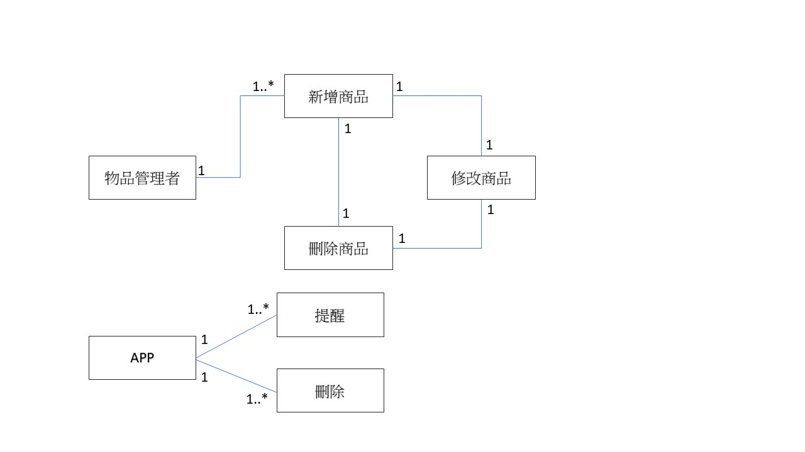
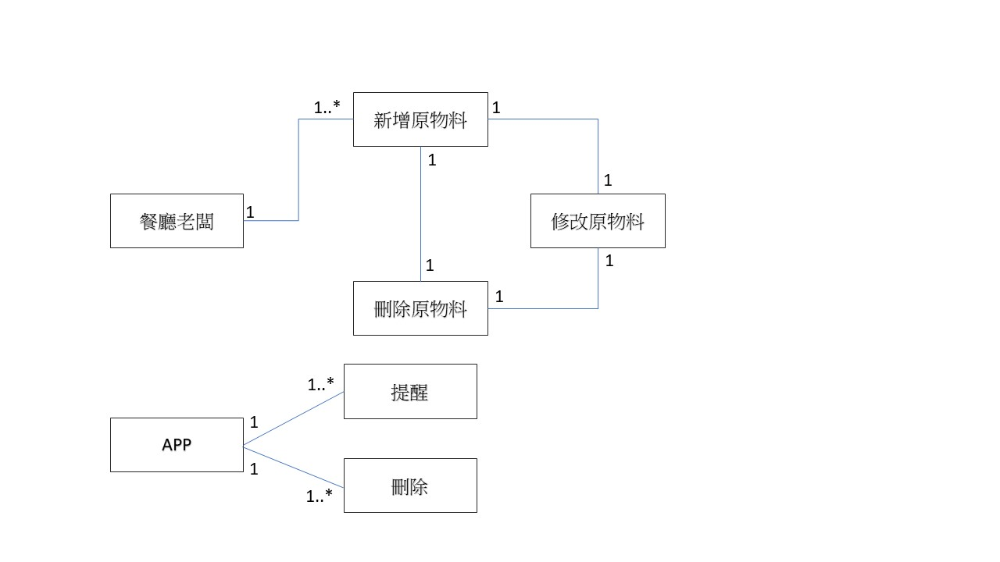

# `智慧物品管家`
### 專題需求：管理物品有效日期、放置位置
### 功能性需求：
```
> 系統應能記錄：物品名稱、有效日期、放置地區

> 新增、修改、刪除紀錄

> 分類各項物品

> 可透過搜尋，查詢物品詳細資訊

> 提醒"一個禮拜後將過期"
```
### 非功能性需求：
```
> 操作性：可跨平台使用

> 效能：系統每24小時應該更新貨品資訊

> 安全：只有個人可以編輯及觀看

> 文化與政策性：系統必須遵循各國包裝食品日期標示方式
```
### 使用案例圖：

### 3個使用案例：居家使用、零售業存貨管理、餐廳原物料管控

### user story：

```
> 身為一個物品管理者，我可以在App上新增我的物品，並且管理物品的分類，且可以提醒我有效期限即將到了，
使我可以更有效率地控管。

> 身為一個家庭主婦，我希望有一個方便管理周遭物品的程式，這樣才不會因為沒注意到物品過期而誤吃或誤用。
我透過紀錄物品詳細資訊，讓系統在物品快到期時，自動提醒我快點將物品使用完畢，如果我超過時間還是忘了用，
它會顯示過期，讓我在搜尋到它的時候會知道該把它丟了！省得我老把過期的食物拿來吃，結果拉肚子。


> 身為一個餐廳老闆，我希望有一個物料的管理App，讓我能夠掌握其狀態，如：有效期限內、已過期、即將過期，
並能具體的提醒員工哪些應該清除或盡快使用完畢，這樣才能更有效的控管整個餐廳物料，並且減少物料浪費的情況。
```
### 初步類別圖:
> 身為一個物品管理者，我希望可以有效管理商品有效日期，以便讓我有效控管商品存貨品質。

> 身為一個家庭主婦，我希望有一個方便管理周遭物品的程式，這樣才不會因為沒注意到物品過期而誤吃。

> 身為一個餐廳老闆，我希望有一個專業的管理系統，這樣才能有效的控管整個餐廳物料的有效日期。


### 系統循序圖:

