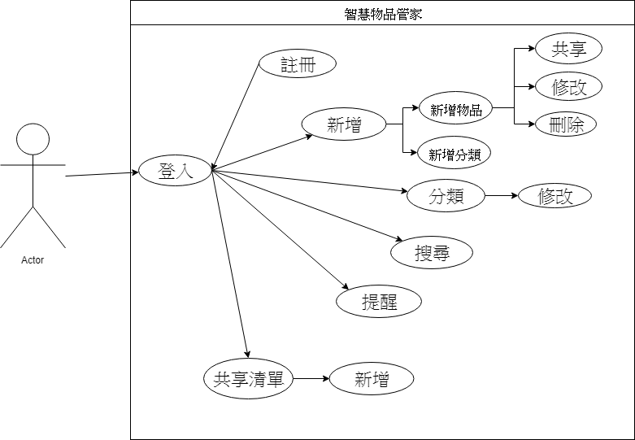
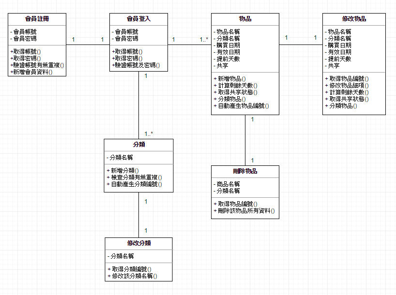
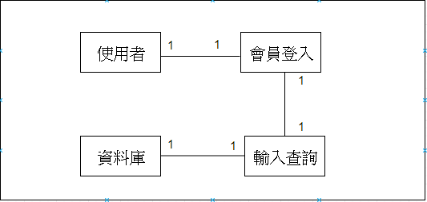
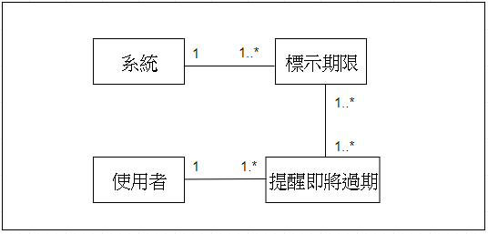
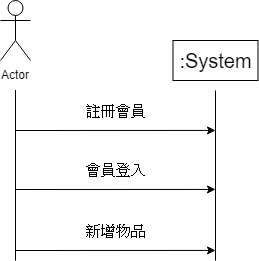
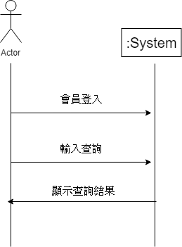
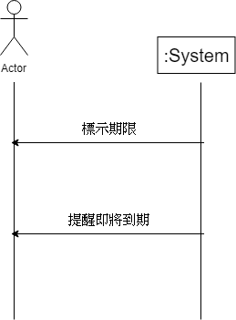
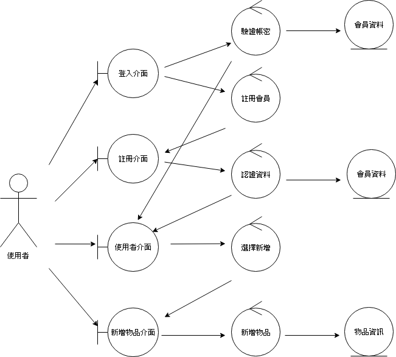
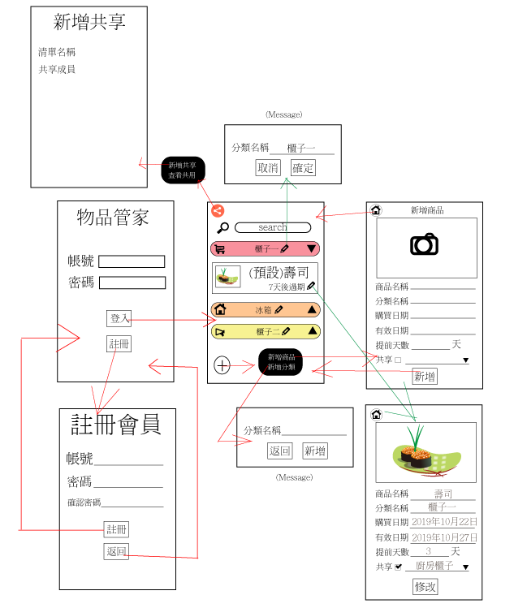
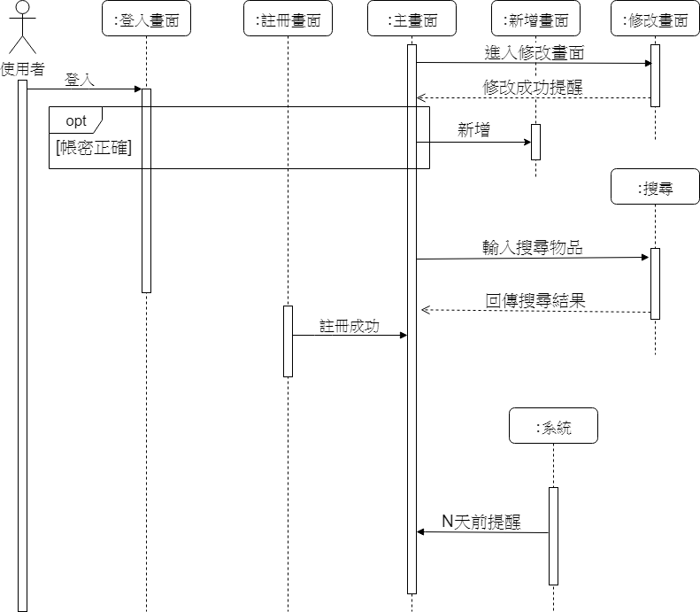

# 智慧物品管家
### 專題需求：管理物品有效日期、放置位置
### 功能性需求：
```
1、會員登入
2、建立資料
3、分類查詢
4、物品搜尋
5、提醒即將過期
```
### 非功能性需求：
```
1、操作性：可跨平台使用
2、效能：系統每24小時應該更新貨品資訊
3、安全：只有個人可以編輯及觀看
4、文化與政策性：系統必須遵循各國包裝食品日期標示方式
```
### 使用案例圖：


### 使用案例的重要性：
```
1、建立資料
2、會員搜尋物品
3、提醒會員物品即將過期
```
### 使用案例：

一、建立資料
```
1、註冊會員
2、會員登入
3、新增物品
4、查詢分類
```
二、會員搜尋物品
```
1、登入會員
2、使用者輸入欲查詢之物品
3、系統搜尋對應之物品
4、系統顯示查詢結果
```
三、提醒會員物品即將過期
```
1、登入會員
2、系統自動辨別物品期限狀態並標示狀態
3、系統提醒即將過期之物品
4、顯示訊息告知使用者
```

### user story：
```
身為一個物品管理者，我希望能透過該系統，使我可以更有效率地控管物品。
```

### 初步類別圖:
一、建立資料



二、會員搜尋物品



三、提醒會員物品即將過期



### 系統循序圖:
一、建立資料



二、會員搜尋物品



三、提醒會員物品即將過期




### 強韌圖:
一、建立資料



### 介面設計草稿:

### 循序圖:

